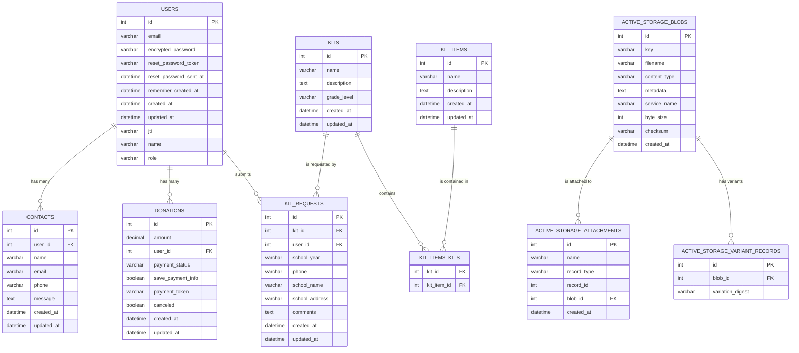

Project Aware
Inclusive Education Support App

Overview
This app provides teachers with resources to support social-emotional learning for all students. It offers free kits containing books with neurodivergent characters, tailored lesson plans by grade levels, and options for scheduling speakers and making donations to support the mission of inclusive education.

Features
Resource Kits: Sign up to receive free kits with books and lesson plans.

Speaker Requests: Request speakers to educate and advocate for neurodivergent individuals.

Donations: In app forms for donations, with no storage of financial data for better security.

User Roles: Role-based access control for administrators and regular users.

File Management: Active Storage for handling image uploads.

Technologies
Backend: Rails API with SQLite3 database.

Frontend: React, styled using Bootstrap.

Authentication: Devise and Devise-JWT for secure token-based authentication.

Authorization: Cancancan for managing user permissions.

File Uploads: Active Storage for managing file attachments.

CORS: Rack CORS for secure frontend-backend communication.

Future Stretch Goals
Fully integrate Stripe for donations.

Visualize data from tables using charts.

Incorporate a 3rd party API for school information.

Improve data integrity by refining table columns.

Complete scheduling speaker events.

Add a forum for teacher communication.

Provide online content for teachers.

Contributing
Feel free to submit issues or pull requests. We welcome contributions to improve the app and support inclusive education!

Created by Marcia Hope
